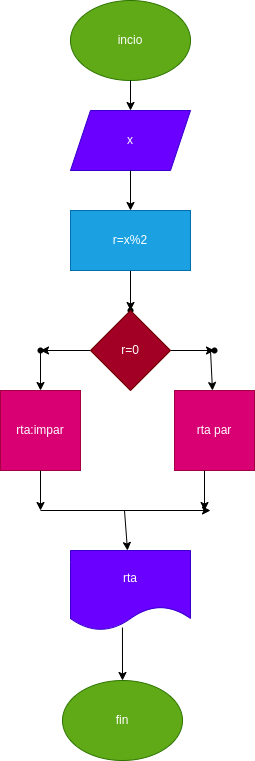

# par_impar
programa para verificar si el numero es  par o impar
## crear un programa  para verificar si un numero es par o impar

# analisis

-variable

X : numero ingresado

-variable de salida

rta : nos va a decir si es par o impar

# diseño

# construccion 

ejercicio n.4 implementar un programa que verifique si un numero es par o impar

r=(x % 2) : nos va decir si RTA es par o impar 

## este archivo estaa escrito en lenguaje markdown